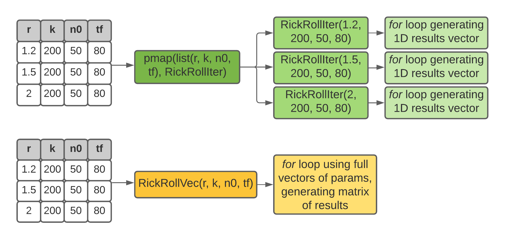

```{css, echo=F}
.codeChunk {
background-color: rgb(247, 247, 247);
border: 10px solid rgb(247, 247, 247);
border-radius: 4px
}
```

```{r, include=F}
library(tidyverse)
library(patchwork)
knitr::opts_chunk$set(fig.fullwidth=TRUE, dpi=300, fig.width=9, fig.height=5, class.source = "codeChunk")

my_theme <- MCMsBasics::minimal_ggplot_theme()
```

My 2nd year of grad school I took a fantastic course called Computational Methods in Population Biology (ECL 233), taught by my one of my co-advisors, [Sebastian Schreiber](https://schreiber.faculty.ucdavis.edu/deep/) and one of my QE committee members, [Marissa Baskett](http://www.des.ucdavis.edu/faculty/baskett/). The course was pretty evenly split between ecologists and applied math students, and focused on pretty applied mathematical modeling concepts. As a quantitative ecologist with relatively sparse formal mathematical training, but pretty solid computational/R skills, this course was incredible. Being able to implement models in R meant I could poke and prod the models, changing parameters or investigating intermediate values. This helped me translate the more formal mathematical models into data I could work with like any other. [Richard McElreath](https://xcelab.net/rm/) notes this pedagogical benefit in posterior distribution sampling in Bayesian statistics in his fantastic book, [Statistical Rethinking](https://xcelab.net/rm/statistical-rethinking/)^[I'm not usually one to fawn over academic stuff, but Statistical Rethinking absolutely changed the way I think. Not only did it give me a deep appreciation and intuition for Bayesian data analysis, but it is an absolute pedagogical marvel. If you haven't read it yet, run, don't walk, to grab a copy.].

Back when I took ECL 233, I was a relatively confident R user, but nowhere near as competent as I am now. In particular, I've come to embrace a `tidier` approach to working with data, trying to keep things in dataframes/tibbles as much as possible. This has been remarkably slick while simulating data for the sake of testing out statistical models or more formal simulation-based calibration (perhaps the topic of a later blog post). You set up parameters in their own columns, so each row has a full set of parameters necessary to generate data, then you store the resulting data in a list-column.

In discrete-time population models, you can't vectorize everything since the population size is calculated from the population size at the last time step, so you've gotta use a `for` loop at some point. What this often means is that population simulations are stored in matrices or arrays; for example, you might have a matrix where each column corresponds to an `r` value for your model, and each row corresponds to a time step. You then use a `for` loop to generate the time series for each `r` value's column. R is pretty nice for working with matrices and arrays, and they'll often be the fastest/most efficient way to implement big ole models. But in some cases, it would be really nice to be able to use a more `tidy` approach, for the sake of plotting and organization. It can be really nice to have all your parameters neatly associated with all your simulated outcomes in a single tibble. I hate having a bunch of disparate vectors and matrices floating around for a single model, so this approach really appeals to me.

To demonstrate this approach, I reformatted one of my ECL 233 homework assignments looking at the Ricker model^[[Ricker's original paper](https://cdnsciencepub.com/doi/10.1139/f54-039)] and its ability to generate **C H A O S**. I'll show how a tidy approach makes it easy to look at different parameter values, plot our results, and calculate various things about our model.

```{marginfigure}


Rick Astley's fashion sense is like a classic theoretical paper: timeless. Seriously, get a load of that black turtleneck and trousers under a stone trench coat...

```

## Load packages 

```{r, message=F}
library(tidyverse)
library(patchwork)
```


## Writing out the model

First we write a function that calculates an update of the Ricker model, then a function that takes parameter inputs, a starting value, and a number of iterations, and generates values from the Ricker model through time.
```{r}
RickRoll <- function(nt, r, k){
  nt * exp(r * (1-nt / k))
}

RickRollIter <- function(r, k, n0, tf){
  data <- rep(n0, tf)
  
  for (t in 1:(tf-1)) {
    data[t+1] <- RickRoll(nt = data[t], r = r, k = k)
  }
  
  return(tibble(results = data,
                timestep = 1:tf))

}


```


## Setting up and running simulations

Next, we'll set up our basic simulation table, which holds parameters in a nice tidy format. Here we use the same values for `k`, `n0`, and `tf`, but we look at a few different values of `r`.
```{r}
sim <- tibble(k = 100,
              n0 = 50,
              tf = 80,
              r = c(1.5,2.3,2.6,3.0))
```

Next, we use the `pmap()` function to operate on each row of our tibble individually. We take the parameter inputs and use the `RickRollIter()` function to generate a time series, which gets stored in a list-column.
```{r, cache=T}

sim <- sim %>% 
  mutate(results = pmap(.l = list(r, k, n0, tf), .f = RickRollIter))

sim

```

Finally, we can `unnest()` this column, then plot the population size through time for each separate value of `r`.
```{r}
sim %>% 
  unnest(results) %>% 
  ggplot(aes(x = timestep, y = results)) +
  geom_point() +
  geom_line() +
  facet_wrap(vars(r)) +
  ylab("Pop size") +
  my_theme

```

With this approach we can compare the effects of `r` and `k` separately with only a few more lines of code. We use `expand_grid()` to generate every unique combination of the `r` and `k` values we supply, then add our single values of `n0` and `tf`. The rest of the code proceeds as before.
```{r, cache=T}
expand_grid(k = c(100, 200, 500),
            r = c(1.5, 2.3, 3.0)) %>% 
  mutate(n0 = 50, tf = 80) %>% 
  rowwise() %>% 
  mutate(results = list(
    RickRollIter(r = r, k = k, n0 = n0, tf = tf))) %>% 
  unnest(results) %>% 
  ggplot(aes(x = timestep, y = results)) +
  geom_point() +
  geom_line() +
  facet_grid(rows = vars(r), cols = vars(k)) +
  ylab("Pop size") +
  my_theme
```


## Making a bifurcation diagram

Now let's generate a classic logistic map bifurcation diagram, which shows how a discrete deterministic model can generate **C H A O S** as the value of `r` increases. We do almost the same thing as before, but we need a much finer grid of `r` values to make a nice plot.

```{r, cache=T}
sim_bif <- tibble(k = 100,
              n0 = 50,
              tf = 1000,
              r = seq(from=1.5,to=3.6,by=0.001)) %>% 
  mutate(results = pmap(.l = list(r, k, n0, tf), .f = RickRollIter))

```

Now, instead of plotting population sizes across time, we plot population sizes by `r` value. Because the Ricker model needs some time to settle in on a stable population size, we'll only plot the last 40 time steps for each `r` value.
```{r}
sim_bif %>% 
  unnest(results) %>% 
  filter(timestep > max(timestep)-39) %>% 
  ggplot(aes(x = r, y = results)) +
  geom_point(alpha = 0.3, size = 0.1) +
  ylab("Pop size") +
  my_theme

```

Now with a little color, according to the number of values.
```{r}
sim_bif %>% 
  unnest(results) %>% 
  filter(timestep > max(timestep)-39) %>% 
  group_by(r) %>% 
  mutate(results_round = round(results, 2),
         n_vals = n_distinct(results_round)) %>% 
  ungroup() %>% 
  ggplot(aes(x = r, y = results, color = n_vals)) +
  geom_point(alpha = 0.3, size = 0.5) +
  my_theme +
  theme(legend.position = c(0.15, 0.1), legend.direction = "horizontal") +
  ylab("Pop size") +
  colorspace::scale_color_continuous_sequential(
    palette = "Purple-Yellow")
```


## Adding the Lyapunov exponent

Next, we'll calculate the Lyapunov exponent, which is a measure of the divergence of two infinitesimally close trajectories^[Quick reminder- I am definitely not a mathematician and should not be held responsible if a mathematician yells at you for repeating any of this]. Chaos in discrete systems can be thought of as an extreme sensitivity to starting conditions. Though we can exactly predict outcomes given an exact starting condition, if we nudge that condition even slightly, then we have NO idea what's going on. So the Lyapunov exponent is a way to figure out if our system is chaotic. A positive Lyapunov exponent is indicative of chaos.
```{r}
# function for Ricker
f <- function(r, x) x * exp(r * (1 - x))

# function for derivative of Ricker
fp <- function(r, x) exp(r * (1 - x)) * (1 - r * x) 

get_lyap <- function(n0, r, tf){
  n <- n0
  lyap <- 0
  for(t in 1:tf){
    n <- f(r, n)
    lyap <- lyap + log(abs(fp(r, n)))
  }
  lyap <- lyap/tf
  return(lyap)
}
```

Let's calculate the Lyapunov exponent for each `r` value, then make a plot of these values. We'll then stack it on top of our bifurcation diagram and add some vertical lines to show how the positive Lyapunov value peaks correspond to the bifurcation points. One of the benefits of the `tidy` approach here is that we can store pretty different things (time series and Lyapunov exponents) in the same place, always associated with the parameters that generated them.

```{r, cache=T}

sim_bif <- sim_bif %>% 
  rowwise() %>% 
  mutate(lyap = get_lyap(n0 = n0, r = r, tf = tf)) 

r_bifs <- c(2, 2.525)

sim_bif

py <- sim_bif %>% 
  ggplot(aes(x = r, y = lyap)) +
  geom_line(aes(color = lyap > 0, group = 1)) +
  geom_hline(yintercept = 0, lty = 2) +
  geom_vline(xintercept = r_bifs, lty = 2, color = "red") +
  scale_color_manual(values = c("black", "red")) +
  my_theme +
  ylab("Lyapunov exponent") +
  theme(legend.position = "none", 
        axis.text.x = element_blank(), 
        axis.title.x = element_blank())

pb <- sim_bif %>% 
  unnest(results) %>% 
  filter(timestep > max(timestep)-39) %>% 
  ggplot(aes(x = r, y = results)) +
  geom_point(alpha = 0.3, size = 0.1) +
  geom_vline(xintercept = r_bifs, lty = 2, color = "red") +
  ylab("Pop size") +
  my_theme

py / pb

```


## Thoughts on the `tidy` approach

Well, I achieved my goal of proving to myself that I could translate an old base R homework assignment into a `tidyverse` approach. I think I've convinced myself this list-column tibble approach could be useful for population models, at least relatively simple ones. It's really not all that much translation from a matrix-based approach either. The main steps were turning the `for` loop into the `RickRollIter()` function, and making it generate a 1-dimensional output, since we're only feeding it a single set of parameters at a time.

I think what I like most about this approach is that once you've set up your basic tibble structure, you can just keep building up components. You can can create arbitrarily large combinations of parameter inputs, use multiple models, and do as many calculations as you want, all organized together.

# The need for S P E E D

```{marginfigure}

```

After writing the previous sections and dusting my hands off I got a tiny little bit obsessed with the speed of a vectorized, matrix-based approach compared to our tidy `pmap()` approach. There's no doubt that using R's highly optimized matrix and vector operations gives you the fastest simulations, but you don't get some of the benefits of tidiness we've talked about so far.

The primary benefit of a matrix-based approach is that you get to use R's vectorization capabilities. When you start a `for` loop that goes through each time step of your simulation, you can pass a vector of values (`r`, `n`, `k`) to your model function (`RickRoll()` in our case), which will be really fast. Our `pmap()` approach can't do that, because we're only operating on one row of our dataframe at a time. Each row has its own `for` loop generating its time series.

There's an approach that makes use of R's vectorization AND a tidy approach, and I've written a function to demonstrate it here:

```{r}
RickRollVec <- function(r, k, n0, tf) {
  res <- matrix(ncol = length(r), nrow = tf[1])
  res[1, ] <- n0
  
  for (t in 2:tf[1]) {
    res[t, ] <- RickRoll(res[t-1, ], r = r, k = k)
    
  }
  
  as.list(as.data.frame(res))
  
}

```


It's similar to `RickRollIter()`, but it takes entire vectors of input values and creates a matrix to store all the results. Then, it turns that matrix into a list, which can be stored in a list-column. To use it how we've been using it so far, you have to add a couple more steps to the pipeline:

```{r}

sim <- sim %>% 
  mutate(results = RickRollVec(r = r, k = k, n0 = n0, tf = tf)) %>% 
  mutate(timestep = map(results, seq_along)) %>% 
  unnest(c(results, timestep)) 

sim

```

The drawback to this approach is that the `RickRollVec()` function doesn't give you the time step for each value. I've tried a lot of approaches to getting the time step within the function, but they are all significantly slower than the approach here, which is to use `map()` and `seq_along()` to put the time steps back in. Then we have two list-columns, which we `unnest()`.

Here's a little diagram showing how the vectorized and `pmap()` approaches differ^[`pmap()` generates many more function calls, leading to an individual `for` loop for each set of parameters. The vectorized approach only uses one `for` loop, and the different parameter values are kept in vectors, allowing the `RickRoll()` function inside the loop to use R's basic vectorized operations. ].




You can see that the vectorized approach generates the same outcomes as `pmap()` did earlier:

```{r}
sim %>% 
  ggplot(aes(x = timestep, y = results)) +
  geom_point() +
  geom_line() +
  facet_wrap(vars(r)) +
  ylab("Pop size") +
  my_theme
```

Finally, we can benchmark the times for our approaches to see just how much they differ in speed.

```{r, cache=T}

sim <- tibble(k = 100,
              n0 = 50,
              tf = 1000,
              r = seq(from=1.5,to=3.6,length.out = 1000))

runloop <- function() {
  res <- matrix(NA, nrow = sim$tf[1], ncol = length(sim$r))
  res[1, ] <- sim$n0
  
  for (t in 1:(sim$tf[1] - 1)) {
    res[t + 1, ] <- RickRoll(res[t, ], r = sim$r, k = sim$k)
  }
  return(res)
}

microbenchmark::microbenchmark(
  vectorized = sim %>% 
  mutate(results = RickRollVec(r = r, k = k, n0 = n0, tf = tf)) %>% 
  mutate(timestep = map(results, seq_along)) %>% 
  unnest(c(results, timestep)),
  
  pmap = sim %>% 
  mutate(results = pmap(.l = list(r, k, n0, tf), .f = RickRollIter)),
  
  loop = runloop(),
  
  times = 10
)
```

As you can see, the `pmap()` approach is far and away the slowest^[If your model runs take long enough, you can probably benefit from some parallelization. The [furrr package](https://furrr.futureverse.org/) allows you to drop in parallelized `map` functions, which can provide significant speed increases]. While the straight `for` loop approach is the fastest, it is only 4-5x faster, compared to the orders of magnitude difference with `pmap()`. Additionally, the `for` loop approach only gives us a matrix back, and any slicing and dicing we want to do to get it into a nicer format is going to take a) time to write and b) some computational power.

I think the `RickRollVec()` approach gives you the best of both worlds. One thing to note is that the `RickRollVec()` and `for` loop approaches require you to keep the number of simulation steps constant. The underlying results matrix needs to be rectangular, so you have to use the same number of iterations for every set of parameters. With the `pmap()` approach, you can vary the number of steps as well, since each row uses its own separate `for` loop. As with most things computational, there are some tradeoffs between readability, ease of use, and speed. While it's often tempting to go for the most blazing-fast approach to simulation models, it's worth considering the time you put into implementing that approach and the time needed to clean up the results to make them more workable. Finding the right balance for your workflow and model combination is important, and you may find that some `tidyverse` approaches make sense for you.

<!-- is there a way to use map() instead of a for loop to map an update function across a state vector? Did I do something like this for a locust ABM at some point? -->
<!-- hould also look into accumulate() -->

